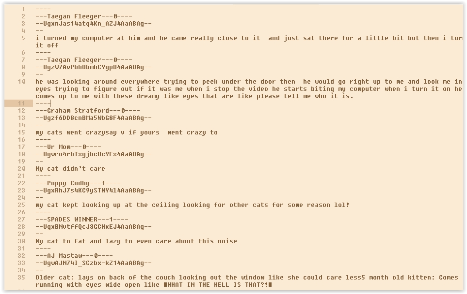

# YouTube Comments

Extremely simple script to get all the comments of a YouTube Video into a text file (for e-readers), back in the days when I had the time to read a lot. You could tell this was a long time ago, because I used PHP, unaware of the greatness of Python

